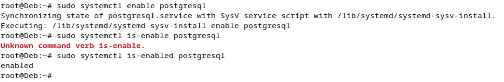

> **Выполнил:**
> Лахмостова Ю.А.
>
> **Группы:**
> ИС -- 21

Цель задания: настроить окружение, установить PostgreSQL в Debian,
освоить базовые приёмы администрирования системы и СУБД.

Задание:

1.  Подготовить среду на виртуальной машине Debian;

2.  Установить PostgreSQL;

3.  Создать служебную учётную запись;

4.  Настроить основные файлы конфигурации, внести изменения,
    перезапустить сервис;

5.  Изучить управление сервисами Debian (systemd);

6.  Создать тестовую базу;

7.  Узнать, что такое схема в PostgreSQL и в чём разница между базой
    данных и схемой;

8.  Использовать утилиты psql для базовых операций;

9.  Произвести подключение через pgadmin или dbeaver с локальной машины;

10. Настроить журналирование, вывести пример строк лога;

11. Продемонстрировать, как в PostgreSQL наследуются права между ролями.

**\
**

1.  Подготовка среды. Установить на виртуальной машине Debian 11/12
    (VMware\\VirtualBox\\HyperV\\WSL). Убедиться, что система обновлена
    (команда apt-get update && apt-get upgrade).

{width="6.496527777777778in"
height="1.725in"}

-   apt-get update: обновляет список доступных пакетов.

-   apt-get upgrade: устанавливает обновления для уже установленных
    пакетов.

-   sudo apt-get install net-tools установить пакет netstat

2.  Установка PostgreSQL. С помощью пакетного менеджера apt установить
    PostgreSQL (последнюю доступную версию из репозиториев). Привести
    команды установки и их объяснение.

{width="6.182717629046369in"
height="2.5675962379702537in"}

{width="6.214994531933509in"
height="2.929783464566929in"}

{width="6.496527777777778in"
height="0.6416666666666667in"}{width="6.496527777777778in"
height="2.3694444444444445in"}

-   sudo apt-get install postgresql (установка)

-   sudo systemctl status postgresql (проверка статуса служб)

-   sudo systemctl start postgresql (Запустить)

-   sudo systemctl stop postgresql (Остановить)

-   psql --version (узнать версию)

3\. Создание служебной учётной записи. Проверить, что при установке
создана учётная запись postgres. Объяснить её назначение и права в
системе.

{width="6.496527777777778in"
height="0.5895833333333333in"}

Обычно по-умолчанию создается учетная запись, но все равно нужно
проверить её наличие.

-   sudo -u postgres psql - создание

-   id postgres -- проверка пользователя

-   Учётная запись postgres --- это суперпользователь PostgreSQL.

-   **Права**: Полный доступ к базам данных (полный доступ к базам
    данных и управление ролями, таблицами и настройками)

4\. Первичная настройка конфигурационных файлов. Найти и изучить
основные файлы конфигурации PostgreSQL (например, postgresql.conf,
pg_hba.conf). Внести изменения (например, задать порт, при необходимости
изменить метод аутентификации) и перезапустить сервис PostgreSQL.

{width="6.586994750656168in"
height="0.42276793525809275in"}{width="6.573906386701663in"
height="0.387577646544182in"}

{width="6.496527777777778in"
height="0.18819444444444444in"}
{width="6.496527777777778in"
height="2.348611111111111in"}
{width="6.496527777777778in"
height="0.6513888888888889in"}{width="6.496527777777778in"
height="2.25in"}{width="6.496527777777778in"
height="0.7270833333333333in"}
{width="6.496527777777778in"
height="0.7083333333333334in"}

{width="6.496527777777778in"
height="0.99375in"}

1\. Находим где у нас лежат данные файлы конфигурации и заходим в них

2\. Меняем параметры: порт 5432 на 5433, peer на trust (было соединение
только для локальных соединений, а тепреь доступ без учета проверки
учетных данных для локальных подключений), scram-sha256 на md5 (смена
аутентификации по паролю с помощью шифра с sha256 на шифр md5)

3\. Сохраняем, проверяем и перезапускаем всё, а так же провкеряем наши
изменения, и подключамся к postgres указывая localhost и новый порт 5433

-   sudo find /etc/postgresql -name \"postgresql.conf\" -- найти где
    лежит postgresql.conf

-   sudo find /etc/postgresql -name \"pg_hba.conf\" -- найти где лежит
    pg_hba.conf

-   sudo nano /etc/postgresql/17/main/pg_hba.conf

-   sudo netstat -tuln \| grep 5433 -- проверка порта 5433

-   sudo systemctl restart postgresql -- обновление

-   psql -h localhost -p 5433 -U postgre

-   postgresql.conf: основной файл конфигурации PostgreSQL.

-   pg_hba.conf: управляет аутентификацией.

5\. Управление сервисом. Использовать инструменты управления сервисами
Debian (systemd) --- проверить статус сервиса PostgreSQL, включить
автозапуск.

{width="6.496527777777778in"
height="1.7395833333333333in"}
{width="6.496527777777778in"
height="1.0652777777777778in"}

-   sudo systemctl status postgresql статус проверка

-   sudo systemctl start postgresql запустить

-   sudo systemctl enable postgresql автозапуск

-   sudo systemctl is-enabled postgresql проверка на атозапуск

-   sudo systemctl restart postgresql перезапуск

-   sudo systemctl stop postgresql остановить

6\. Создание тестовой базы данных. Создать отдельного пользователя
(логин задать в формате ФИО) в PostgreSQL, новую базу данных (нейминг
аналогичен) и задать ему пароль. Использовать psql, чтобы проверить
доступ.

{width="6.496527777777778in"
height="3.6055555555555556in"}

-   psql -h localhost -p 5433 -U postgres подключиться по порту 5433

-   CREATE USER lya WITH PASSWORD \'12345\';

-   CREATE DATABASE dblya OWNER lya;

-   \\du проверить пользователей

-   \\l проверка БД

-   \\q выход

7\. Знакомство со схемами. Объяснить, что такое схема в PostgreSQL, в
чём разница между базой данных и схемой. По умолчанию существует схема
public. Создайте ещё одну схему, например, test_schema. Настройте у
пользователя, созданного выше, права на использование этой схемы
(команда GRANT). Продемонстрируйте, как работать с разными схемами
(смена search_path или обращение к объектам через
test_schema.table_name).

{width="6.496527777777778in"
height="1.5805555555555555in"}
{width="6.496527777777778in"
height="2.9375in"}

-   \\c dblya зайти в БД

-   CREATE SCHEMA test_schema; создать схему

-   GRANT USAGE ON SCHEMA test_schema TO lya; передать права на схему

-   GRANT CREATE ON SCHEMA test_schema TO lya; создать схему

-   CREATE TABLE lya_table (id SERIAL PRIMARY KEY, name TEXT);

-   ALTER TABLE lya_table SET SCHEMA test_schema;

-   SELECT \* FROM test_schema.lya_table;

8\. В схеме public создать тестовую таблицу, внести несколько записей,
выполнить основные SQL-запросы (SELECT, INSERT, UPDATE, DELETE). В схеме
из 7 задания test_schema создать другую таблицу и внести несколько
записей. Покажите, как к ней обращаться. Использовать скрипт, который
демонстрирует создание таблицы с привязкой к конкретной схеме.

{width="6.496527777777778in"
height="1.801388888888889in"}

{width="6.496527777777778in"
height="1.6381944444444445in"}
{width="6.496527777777778in"
height="1.7673611111111112in"}
{width="6.496527777777778in"
height="2.015972222222222in"}
{width="6.496527777777778in"
height="1.9090277777777778in"}

Создадим в схеме public таблицу, внесем несколько записей и выполним
основные SQL-запросы

CREATE TABLE public.public_lya_table (id SERIAL PRIMARY KEY, name
VARCHAR(20));

INSERT INTO public.public_lya_table (name) VALUES (\'pubname1\'),
(\'pubname2\'), (\'pubname3\');

SELECT \* FROM public.public_lya_table;

UPDATE public.public_lya_table SET name = \'текст\' WHERE id = 1;

DELETE FROM public.public_lya_table WHERE id = 2;

9\. Настроить доступ к базе данных по локальной сети (например,
разрешить подключаться к PostgreSQL с другого хоста). Объяснить
параметры listen_addresses и формат строки в pg_hba.conf. Произвести
подключение через pgadmin или dbeaver с локальной машины.

{width="6.496527777777778in"
height="1.3777777777777778in"}

{width="6.496527777777778in"
height="3.2020833333333334in"}{width="6.496527777777778in"
height="1.31875in"}

{width="5.52179571303587in"
height="4.505383858267717in"}{width="5.594726596675415in"
height="3.1110378390201223in"}

{width="5.557064741907261in"
height="3.6520395888014in"}{width="5.480452755905512in"
height="3.151571522309711in"}

-   ALTER USER postgres WITH ENCRYPTED PASSWORD \'новый_пароль\'; для
    смены пароля

10\. Изменить настройки журналирования в postgresql.conf, перезапустить
сервис и проверить, как новые логи записываются. Найти логи в Debian и
вывести примеры строк лога.

{width="6.496527777777778in"
height="1.5333333333333334in"}
{width="6.496527777777778in"
height="1.1818186789151357in"}{width="6.496527777777778in"
height="0.7930555555555555in"}{width="6.496527777777778in"
height="3.546527777777778in"}
{width="6.496527777777778in"
height="0.3277777777777778in"}

log_destination = \'stderr\' \# Логи будут записываться в стандартный
вывод ошибок

logging_collector = on \# Включаем сбор логов

log_directory = \'pg_log\' \# Логи будут сохраняться в директорию pg_log

log_filename = \'postgresql-%Y-%m-%d\_%H%M%S.log\' \# Имя файла логов с
датой и временем

log_rotation_age = \'1d\' \# Новый файл логов создаётся каждый день

log_rotation_size = \'10MB\' \# Максимальный размер файла логов --- 10
МБ

log_min_messages = \'info\' \# Записывать сообщения уровня info и выше

log_statement = \'all\' \# Записывать все SQL-запросы

11\. Создать роль с ограниченными привилегиями и протестировать, какие
операции она может выполнять (роль назвать limited_user).
Продемонстрировать, как в PostgreSQL наследуются права между ролями.
Объяснить выдачу прав через GRANT

{width="5.80041447944007in"
height="3.6216152668416446in"}{width="5.790737095363079in"
height="3.7938451443569554in"}

{width="6.496527777777778in"
height="2.217361111111111in"}
{width="6.496527777777778in"
height="0.2013888888888889in"}{width="6.496527777777778in"
height="1.195138888888889in"}

GRANT используется для выдачи прав ролям или пользователям.

GRANT SELECT ON limit_table TO limited_user; - даёт право на чтение
данных из таблицы.

GRANT INSERT, UPDATE ON limit_table TO limited_user; - даёт право на
вставку и обновление данных.

GRANT ALL PRIVILEGES ON limit_table TО limited_user; - даёт все права на
таблицу.

GRANT limited_user TO another_user; - добавляет одну роль в другую,
позволяя наследовать права.
