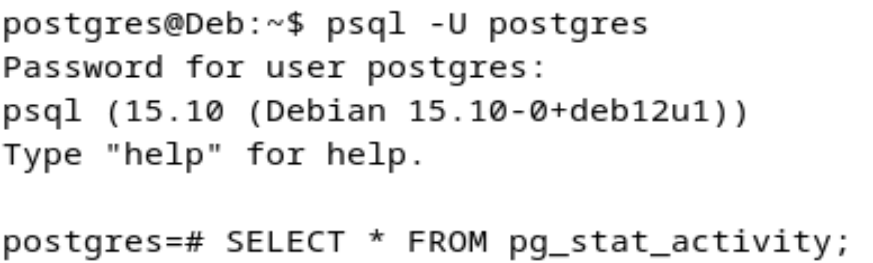
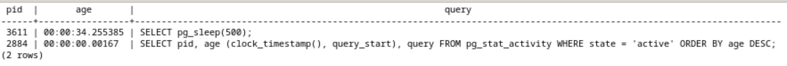

1\. Утилиты резервного копирования. Изучить и сравнить pg_dump и
pg_basebackup. Описать сценарии применения каждой утилиты.

PostgreSQL предоставляет два основных способа резервного копирования --
логический (pg_dump) и физический (pg_basebackup).

**Логический бэкап (pg_dump):**

-   Копирует структуру (таблицы, схемы) и данные отдельно.

-   Позволяет гибко восстанавливать (можно выбрать, какие таблицы или
    схемы восстановить).

-   Подходит для миграции между серверами (даже если у них разные версии
    PostgreSQL).

**Физический бэкап (pg_basebackup)**

-   Копирует все файлы базы данных PostgreSQL.

-   Используется для репликации и восстановления сервера в том же виде.

-   Не позволяет выбрать отдельные базы или таблицы -- всё копируется
    целиком.

-   Подходит для аварийного восстановления и создания реплики БД.

2\. Выполнить полное резервное копирование (dump) базы данных из лаб.
№1. Использовать параметры (например, -Fc, -Ft, обязательно посмотреть
другие параметры).

{width="6.496527777777778in"
height="1.6916666666666667in"}{width="6.496527777777778in"
height="0.9729166666666667in"}

-   psql -U postgres - Подключаемся к PostgreSQL

-   \\l - Выводим список БД, с ними можно работать

-   sudo -u postgres pg_dump -U postgres -d dblya -Fc -f
    dblya_backup.dump - Создаём резервную копию

    -   -Fc -- формат custom создает резервную копию в специальном
        бинарном формате, который поддерживает сжатие и позволяет
        восстанавливать отдельные объекты

    -   -Fp -- создает копию в виде SQL скрипта

    -   -Fd -- сохраняет в виде набора файлов в каталоге

    -   -Ft -- tar-архив

3\. Частичное (выборочное) резервное копирование. Сделать дамп только
определённой схемы (например, test_schema, созданной в ЛР №1). Сделать
дамп только определённых таблиц из схемы public. Объяснить, в чём
отличие от резервного копирования всей базы.

{width="6.496527777777778in"
height="0.25763888888888886in"}
{width="6.496527777777778in"
height="0.5527777777777778in"}
{width="6.496527777777778in"
height="0.6in"}

-   pg_dump -U postgres -d dblya -Fc -f dblya_test_schema.backup.dump -n
    test_schema

    -   -U postgres: используем пользователя PostgreSQL postgres.

    ```{=html}
    <!-- -->
    ```
    -   -d dblya: делаем бэкап базы данных dblya.

    -   -Fc: выбираем формат Custom (сжатый бинарный формат).

    -   -f dblya_test_schema.backup.dump: указываем имя файла резервной
        копии.

    -   -n test_schema: резервируем только схему test_schema, игнорируя
        остальные схемы в базе.

-   pg_dump -U postgres -d dblya -Fc -f dblya_public_table_backup.dump
    **-t public.public_lya_table**

    -   -t public.public_lya_table: вместо -n (схема) используется флаг
        -t, указывающий конкретную таблицу public_lya_table в схеме
        public.

**Разница между полным и частичным копированием.**

Полная копия включает все схемы и таблицы базы dblya.

Частичная копия (-n или -t) позволяет скопировать только выбранные
объекты (определённую схему или таблицу). Полное копирование удобно в
случае перноса всей базы данных. Частичное копирование удобно для
переноса или выгрузки конкретного элемента.

4\. Восстановление из резервной копии. Восстановить базу из резервного
файла с помощью pg_restore или утилиты psql. Продемонстрировать процесс
и результаты.

Восстановление с помощью утилиты psql подходит для формата SQL или же
-Fp. В других случая можно восстановить с помощью pg_restore.

-   createdb -U postgres db1r2 -- создаем новую БД

{width="6.496527777777778in"
height="0.5125in"}

-   ls -- смотрим содержание бэкапов

{width="6.496527777777778in"
height="0.5402777777777777in"}

-   pg_restore -U postgres -d db1r2 -v dblya_backup.dump

    -   pg_restore: утилита для восстановления бэкапов pg_dump (в
        формате tar, custom, directory).

    -   -U postgres: указываем пользователя PostgreSQL postgres.

    -   -d db1r2: восстанавливаем в новую базу db1r2.

    -   -v: verbose --- показывает детальный вывод (какие таблицы, схемы
        и т.д. создаются).

    -   dblya_backup.dump: наш файл дампа, полная копия базы dblya.

{width="6.496527777777778in"
height="2.316666666666667in"}

-   psql -U postgres -d db1r2 -- подключаемся к db1r2

-   \\dn -- просмотр схем

-   \\dt -- просмотр таблиц

-   SELECT \* FROM public_lya_table; - проверим наполненность таблицы

{width="5.389067147856518in"
height="3.641292650918635in"}

-   pg_restore -l dblya_backup.dump

    -   -l (list) показывает список объектов (TOC --- Table Of Contents)
        внутри дампа, без фактического восстановления. В выводе можно
        увидеть идентификаторы и названия схем, таблиц, индексов,
        constraints и т.д. Полезно для предпросмотра.

{width="6.438431758530184in"
height="4.609105424321959in"}

5\. Автоматизация бэкапов с помощью cron. Настроить планировщик cron на
Debian, чтобы ежедневно создавать резервные копии. Указать, куда
складываются дампы, и как выполняется ротация.

-   sudo mkdir -p /var/backups/pg -- создаем директорию

{width="6.496527777777778in"
height="0.3611111111111111in"}

-   sudo chown postgres:postgres /var/backups/pg -- выдать права на
    автоматическое создание логов

{width="6.496527777777778in"
height="0.24583333333333332in"}

-   crontab -e -- открываем файл crontab

{width="6.496527777777778in"
height="0.23376531058617672in"}

-   \* / 1 \* \* \* pg_dump -U postgres -Fc -f
    /var/backups/pg/dblya-\$(date +\\%F\_\\%H-\\%M).dump dblya \#
    Ежедневный бэкап базы dblya в формат custom, с датой в названии
    каждую минуту

-   \* / 2 \* \* \* find /var/backups/pg -name \"dblya-\*.dump\" -mtime
    +7 -delete \# Ротация: удаление бэкапов старше 2-х минут

{width="6.678622047244095in"
height="3.4024923447069115in"}

-   systemctl start cron - запускаем

-   systemctl status cron -- смотрим статус

-   ls -l /var/backups/pg -- посмотреть содержимое

> В логах (в выводе systemctl status cron) видно, что cron перечитал
> настройки (RELOAD (crontabs)), а затем запускал команды pg_dump и
> find.

{width="6.496527777777778in"
height="2.7958333333333334in"}

Проверка на наличие дампов по
пути.{width="6.496527777777778in"
height="3.026388888888889in"}

Ротация -- это процесс автоматического удаления резервных копий, которые
старше определённого периода (например, несколько дней или часов). Это
нужно, чтобы:

-   Не переполнялся диск. Со временем бэкапы накапливаются, и, если их
    не удалять, может закончиться место.

-   Поддерживать актуальный набор копий. Хранятся только последние
    (например, за неделю), что позволяет быстро восстановиться в случае
    сбоя без хранения ненужной истории.

6\. Мониторинг состояния системы. Использовать стандартные инструменты
Debian (например, top, htop, iotop) для мониторинга потребления ресурсов
PostgreSQL (CPU, RAM, IO). Уметь объяснить все значения выводимых
показателей.

При вводе команды top, iotop, htop -- отображается таблица с текущими
процессами в системе.

-   12:35:41 up 2 min, 1 user, load average: 2.46, 1.68, 0.69

    -   12:35:41 --- текущее время.

    -   up 2 min --- время, прошедшее с момента загрузки системы.

    -   1 user --- количество залогиненных пользователей.

    -   load average: 2.46, 1.68, 0.69 --- средняя нагрузка на систему
        за последние 1, 5 и 15 минут.

-   Tasks: 171 total, 1 running, 170 sleeping, 0 stopped, 0 zombie

    -   total --- всего процессов (или потоков).

    -   running --- активно выполняющихся процессов.

    -   sleeping --- процессов в режиме ожидания.

    -   zombie --- «зомби»-процессы (уже завершились, но ещё не «убраны»
        родительским процессом).

  ----------------------------------------------------------------------------------------
  PID   USER       PR   NI   VIRT    RES    SHR    S    %CPU   %MEM   TIME+     COMMAND
  ----- ---------- ---- ---- ------- ------ ------ ---- ------ ------ --------- ----------
  626   postgres   20   0    63292   9284   4096   S    0.3    0.5    0:01.25   postgres

  ----------------------------------------------------------------------------------------

-   PID --- идентификатор процесса (Process ID).

```{=html}
<!-- -->
```
-   USER --- под каким пользователем (ОС) запущен процесс.

-   PR и NI --- приоритет (Priority) и nice-значение. Чем выше nice, тем
    «добродушнее» процесс (меньше приоритет).

-   VIRT --- виртуальная память (включая swap, библиотеки, mmap и т.д.).

-   RES --- реальное использование оперативной памяти (resident set
    size).

-   SHR --- общая (shared) память, которую процесс может разделять с
    другими (библиотеки).

-   S --- состояние процесса (S = sleeping, R = running и т.д.).

-   %CPU --- доля CPU, используемая процессом (в процентах).

-   %MEM --- доля оперативной памяти, которую процесс занимает
    (относительно всей RAM).

-   TIME+ --- общее процессорное время, которое процесс уже отработал.

-   COMMAND --- имя процесса (или путь к исполняемому файлу).

{width="5.413194444444445in"
height="0.15030621172353456in"}{width="5.427183945756781in"
height="4.182209098862642in"}

htop --- это улучшенная версия top с цветным интерфейсом и более удобным
управлением.

{width="6.196302493438321in"
height="3.1819411636045496in"}

iotop --- утилита для мониторинга ввода-вывода (IO), то есть
чтения/записи на диск в реальном времени.

-   TID --- идентификатор потока (thread ID) или процесса.

-   PRIO --- приоритет потока.

-   USER --- пользователь, под которым работает поток/процесс.

-   DISK READ / DISK WRITE --- скорость чтения/записи на диск (KB/s,
    MB/s).

-   SWAPIN --- процент времени, когда процесс «подкачивается» (swap).

-   IO\> --- процент времени, когда процесс занят IO (аналог CPU% в
    top).

-   COMMAND --- имя команды/процесса.

{width="5.490927384076991in"
height="2.854342738407699in"}

Так же можно посмтореть процессы мониторинга в postgres:

{width="6.496527777777778in"
height="2.8270833333333334in"}

7\. Мониторинг PostgreSQL Изучить встроенные представления статистики в
PostgreSQL (например, pg_stat_activity, pg_stat_database). Показать, как
смотреть активные процессы, долгие запросы и т.д. Показать, как можно
принудительно завершить процесс зависший или слишком тяжелый запрос.

-   psql -U postgres -- подключились

-   SELECT \* FROM pg_stat_activity; - это встроенное представление в
    PostgreSQL, которое показывает все активные сессии и их состояние.

{width="6.496527777777778in"
height="1.9569444444444444in"}

Вывели все активные сессии:

-   datid, datname: ID и имя базы данных, к которой подключена сессия.

-   pid: идентификатор процесса PostgreSQL (каждое соединение -- это
    отдельный процесс).

-   usename: пользователь базы данных, под которым идёт сессия.

-   application_name: имя приложения (например, psql, DBeaver, PgAdmin и
    т.д.).

-   client_addr, client_port: IP-адрес и порт клиента, если сессия идёт
    по сети.

-   query: текущий запрос, который выполняется (или последний, если
    сессия idle).

-   query_start: когда этот запрос стартовал.

-   state: статус сессии (active, idle, idle in transaction и т.д.).

{width="6.496527777777778in"
height="1.1104166666666666in"}

SELECT \* FROM pg_stat_database; - просмотр работы БД, всей их
статистики, запросов, ошибок, объемы чтения и записи и т.д.

{width="6.496527777777778in"
height="0.4847222222222222in"}

-   datname -- имя базы данных (например, postgres, template1, dblya).

-   numbackends -- число активных бэкендов (подключений) к этой базе.

-   xact_commit / xact_rollback -- общее количество транзакций, которые
    были зафиксированы (commit) или отменены (rollback).

-   blks_read / blks_hit -- сколько блоков было прочитано с диска и
    сколько --- взято из кеша (hit). Чем больше hit, тем эффективнее
    кэширование.

-   tup_returned / tup_fetched / tup_inserted / tup_updated /
    tup_deleted -- статистика по количеству строк, которые возвращены,
    извлечены, вставлены, обновлены или удалены.

-   conflicts, temp_files, temp_bytes, deadlocks -- дополнительные
    показатели о конфликтующих транзакциях, временных файлах,
    взаимоблокировках и т.д.

-   stats_reset -- дата и время последнего сброса статистики.

{width="6.496527777777778in"
height="0.9576388888888889in"}

-   SELECT pid, age (clock_timestamp(), query_start), query FROM
    pg_stat_activity WHERE state = \'active\' ORDER BY age DESC; - поиск
    долгих запросов

{width="6.496527777777778in"
height="0.13680555555555557in"}

-   pg_sleep() -- пример долгого запроса, с помощью которого можно
    протестировать мониторинг.

{width="6.496527777777778in"
height="0.2950754593175853in"}{width="6.496527777777778in"
height="0.5493055555555556in"}

-   SELECT pid, usename, application_name, state, query, query_start
    FROM pg_stat_activity WHERE state = \'active\' AND now() -
    query_start \> interval \'2 minutes\'; - вывести запросы, которые
    длятся больше 2-х минут.

-   SELECT pg_terminate_backend(pid) FROM pg_stat_activity WHERE state =
    \'active\' AND now() - query_start \> interval \'2 minutes\'; -
    отключение всех запосов, которые активеые и больше 2-х минут

{width="6.496527777777778in"
height="1.632638888888889in"}

8\. Логирование и анализ логов. Найти логи PostgreSQL и системные логи
Debian (директория /var/log/, файлы syslog, daemon.log). Определить,
какие события логгирует СУБД, а какие -- ОС.

Логи СУБД.

{width="6.496527777777778in"
height="1.2840277777777778in"}{width="6.496527777777778in"
height="2.7006944444444443in"}

Логи ОС.

{width="6.150833333333333in"
height="3.9212795275590553in"}{width="6.202299868766405in"
height="1.2159295713035871in"}

+----------------------------------+-----------------------------------+
| Логирование PostgreSQL (СУБД)    | ОС Debian                         |
+==================================+===================================+
| 1\. Запуск и остановка сервера   | 1\. Запуск и остановка сервисов.  |
|                                  |                                   |
| Когда сервер базы данных         | ОС фиксирует, когда запускаются,  |
| запускается, останавливается или | останавливаются или               |
| перезапускается, PostgreSQL      | перезапускаются системные службы  |
| записывает сообщения с           | (например, systemd, cron,         |
| информацией об этом.             | rsyslog).                         |
|                                  |                                   |
| 2\. Аутентификация и подключения | 2\. События ядра и оборудования.  |
|                                  |                                   |
| При входе пользователей в базу   | В логах записываются сообщения от |
| (например, при попытке           | ядра (например, ошибки драйверов, |
| подключения через psql или       | проблемы с оборудованием) и       |
| приложения) PostgreSQL           | сообщения о работе дисков, сети и |
| фиксирует, успешно ли прошла     | других устройств.                 |
| аутентификация или возникли      |                                   |
| ошибки (например, неверный       | 3\. Аутентификация и              |
| пароль).                         | безопасность.                     |
|                                  |                                   |
| 3\. SQL-запросы и транзакции     | Файлы, такие как auth.log,        |
|                                  | содержат информацию о попытках    |
| Если включено логирование        | входа в систему, использовании    |
| запросов, СУБД записывает        | sudo, а также об ошибках          |
| выполняемые SQL-команды.         | аутентификации на уровне ОС.      |
|                                  |                                   |
| Также логируются события         | 4\. Общая системная активность.   |
| транзакций -- когда они          |                                   |
| подтверждаются (commit) или      | Записи о работе демонов,          |
| откатываются (rollback).         | обновлении пакетов (dpkg/apt), а  |
|                                  | также другие системные события    |
| 4\. Ошибки и предупреждения      | (например, монтирование файловых  |
|                                  | систем).                          |
| Все ошибки, связанные с          |                                   |
| запросами (например,             |                                   |
| синтаксические ошибки или        |                                   |
| нарушения ограничений), а также  |                                   |
| предупреждения о возможных       |                                   |
| проблемах (например,             |                                   |
| конфликтующие транзакции)        |                                   |
| фиксируются в логах PostgreSQL.  |                                   |
|                                  |                                   |
| 5\. Репликация и                 |                                   |
| административные команды         |                                   |
|                                  |                                   |
| События, связанные с настройкой  |                                   |
| репликации, изменением           |                                   |
| конфигурации и другими           |                                   |
| административными операциями,    |                                   |
| также записываются.              |                                   |
+----------------------------------+-----------------------------------+

**PostgreSQL следит за своей работой:**

-- Когда база запускается или останавливается.

-- Какие запросы выполняются, сколько времени они работают, и есть ли
ошибки в них.

-- Когда пользователь пытается подключиться к базе и с каким
результатом.

**ОС Debian следит за работой всей системы:**

-- Когда запускаются или останавливаются сервисы (например, cron, ssh).

-- Как работает оборудование (диски, сеть, процессор).

-- Кто входит в систему и какие действия выполняются на уровне ОС.
