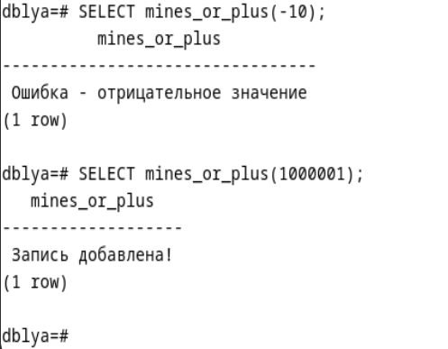
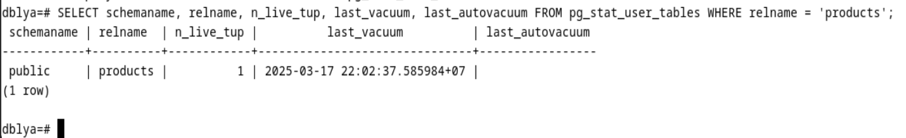

# Отчет по лаборатноной работе №3 Лахмостовой Ю. А. группа ИС-21
**1. Оптимизация конфигурации. PostgreSQL.**

Найти в postgresql.conf параметры, влияющие на производительность:
shared_buffers, work_mem, maintenance_work_mem, effective_cache_size.
Кратко описать их назначение. Установить значения с учётом объёма
оперативной памяти виртуальной машины. Объяснить выбор установленных
значений. Перезапустить PostgreSQL (systemctl restart postgresql).
Проверить установленные параметры командой SHOW shared_buffers; SHOW
work_mem; и т.д.

**sudo nano /etc/postgresql/12/main/postgresql.conf**

-   shared_buffers = 512MB (размер буферного кеша)

Этот параметр определяет, сколько оперативной памяти PostgreSQL будет
использовать для хранения кеша страниц базы данных. Чем больше значение,
тем реже PostgreSQL будет обращаться к диску, что ускоряет выполнение
запросов. Рекомендуемое значение **25-40% от общей оперативной памяти**
сервера.

-   work_mem = 4MB (память на сортировку и хеш-таблицы)

Определяет, сколько памяти можно выделять на одну операцию сортировки.
Размер определяется количеством операций, но не рекомендуется слишком
большое количество. Рекомендуемые значения 4-8 МВ.

 

-   aintenance_work_mem = 64MB (память для операций обслуживания)

Используется для выполнения автоочистки (VACUUM), индексации (CREATE
INDEX), анализа (ANALYZE) и других операций администрирования. Чем выше
значение, тем быстрее выполняются эти задачи. Рекомендуется
устанавливать значение около 50-75% от общей оперативной памяти.

-   sudo systemctl restart postgresql -- перезагружаем

**2. Создание и анализ индексов.**

Использовать таблицы из предыдущих лабораторных работ или при
необходимости добавить новые. При необходимости наполнить их большим
количеством строк для тестирования, смотрим generate_series. Создать
индексы на подходящих полях. Сохранить команды CREATE INDEX. Выполнить
запросы EXPLAIN и EXPLAIN ANALYZE до и после создания индексов. Сравнить
планы (Seq Scan, Index Scan) и время выполнения запросов.

**Индекс в PostgreSQL** --- это специальная структура данных, которая
ускоряет поиск строк в таблице по определённому столбцу (или
нескольким). Без индексов при выполнении запросов база данных должна
**просматривать всю таблицу (Seq Scan)**, что занимает много времени.
Индексы помогают заменить **последовательное сканирование (Seq Scan) на
индексное (Index Scan)**, что значительно ускоряет работу.

Подключаемся к базе данных. Создаем таблицу и заполняем ее числами от 1
до 1 000 000.

Выполняем EXPLAIN ANALYZE до создания индекса и ищем 500 000.

Теперь создаем индекс и снова ищем 500 000.

-   CREATE INDEX index_name ON table_name (column_name);

Время поиска изменилось с 264.849 до 0.091 мс.

**3. Хранимые функции.**

Создать функцию на pgSQL, которая проверяет переданное значение и в
зависимости от результата либо вставляет новую запись в таблицу, либо
возвращает сообщение об ошибке (например, «Запись добавлена» или «Ошибка
отрицательное значение»). Выполнить вызов функции в psql и проверить
результат вставки.

Создаем скрипт на языке PL/pgsql оценки значения mines_or_plus.sql,
который проверяет положительное или отрицательное число перед нами.

Создаем функцию mines_or_plus, которая вернет нам текст. Указываем язык
plpgsql. В теле функции (BEGIN \... END) выполняем проверку условия:
если значение \<0, то вернем сообщение об ошибке, иначе можно добавить
запись в test_lr3(number) данное значение и вывести сообщение об этом.

Загружаем функцию в базу.

Проверяем работоспособность функции на отрицательном и положительном
числе.

Проверим наличие записей или их отсутствие. Видим, что 1 000 001 найдено
в 1 строке, и -10 найдено в 0 строках.

**4. Триггеры.**

Создать триггер (BEFORE или AFTER INSERT/UPDATE), который проверяет
бизнес правила (например: недопустимость отрицательной цены).

Триггер в PostgreSQL --- это механизм, который автоматически выполняет
заданные действия **до** или **после** определенного события в таблице
(например, вставки, обновления или удаления данных).

**BEFORE INSERT/UPDATE** --- выполняется **до** изменения данных.
Позволяет изменить данные перед их записью.

**AFTER INSERT/UPDATE** --- выполняется **после** изменения данных.
Используется для записи логов или вызова внешних процессов.

Создаем триггер для проверки цен check_price.sql

Создаем скрипт проверки цены check_price, которая вернет нам триггер.
Указываем язык plpgsql. В теле функции (BEGIN \... END) выполняем
проверку условия: если значение \<0, то вернем сообщение об ошибке RAISE
EXCEPTION (выбрасываем ошибку с текстом. % подставляет значение
NEW.price).

Создаем новую таблицу

Создаем функцию в БД и сохраним как BEFORE триггер, чтобы скрипт мог
выполниться.

Создаем запись с положительным и отрицательным значением цены и смотрим
результат: положительное значение прошло, а отрицательное отклонилось.

**5. Автоматическая очистка и статистика (VACUUM, ANALYZE).**

Изучить параметры autovacuum (например, autovacuum_naptime,
autovacuum_vacuum_scale_factor). Убедиться, что autovacuum включён
(значение on). Выполнить VACUUM ANALYZE для одной или нескольких таблиц.
Объяснить назначение VACUUM и ANALYZE (очистка «мёртвых» строк,
актуализация статистики). Изучить представления pg_stat_user_tables,
pg_stat_all_indexes и другие. Найти информацию о количестве выполненных
autovacuum и manual vacuum.

PostgreSQL использует многоверсионность, что означает, что при
обновлении или удалении строки её старая версия не удаляется сразу, а
остаётся в таблице. Это нужно для того, чтобы другие транзакции могли
видеть данные в их состоянии на момент начала. Однако со временем такие
\"мёртвые\" строки накапливаются, занимая место и замедляя работу базы.

Проверка на «вкл/выкл»

Проверка настроек:

-   **autovacuum_naptime** -- задаёт интервал времени между проверками
    базы на необходимость запуска autovacuum. Это определяет, как часто
    PostgreSQL будет анализировать таблицы и принимать решение о запуске
    очистки.

-   **autovacuum_vacuum_scale_factor** -- определяет процент \"мёртвых\"
    строк в таблице, после превышения которого запускается процесс
    VACUUM. Чем ниже значение, тем быстрее будет происходить очистка.

-   **autovacuum_analyze_scale_factor** -- задаёт процент изменений в
    таблице, после которого автоматически выполняется ANALYZE для
    обновления статистики. Это помогает актуализировать статистику.

VACUUM: удаляет «мёртвые» строки, освобождая место и предотвращая
разрастание таблицы.

ANALYZE: собирает и обновляет статистику о содержимом таблицы, которую
использует оптимизатор запросов для составления плана выполнения.

VACUUM «имя таблицы»; - удалит мертвые строки, сделает место для новых
записей, а место от старых записей оставит себе на новые.

VACUUM FULL «имя таблицы»; - сожмет таблицу, лишнее место вернет
системе.

VACUUM ANALYZE «имя таблицы»; - комбинация сразу вакуума и анализа.

Чтобы вывести сообщения о том, что выполнилось, можно использовать
команду расширенного вывода

-   VACUUM VERBOSE «имя таблицы»;

-   ANALYZE VERBOSE «имя таблицы»;

Для анализа состояние базы можно использовать pg_stat_user_tables и
pg_stat_all_indexes.

-   pg_stat_user_table: показывает статистику таблиц, в том числе время
    последнего autovacuum и manual vacuum.

    -   n_live_tup -- количество \"живых\" строк.

    -   last_vacuum -- когда последний раз выполняли VACUUM.

    -   last_autovacuum -- когда autovacuum последний раз работал.

-   pg_stat_all_indexes: показывает статистику индексов, например,
    сколько раз PostgreSQL использовал индексы.

    -   idx_scan -- сколько раз индекс использовался.

-   pg_stat_database: статистика по базе данных (например, число
    autovacuum-вызовов для базы данных в целом).

    -   datname - имя базы данных.

    -   numbackends - количество клиентских подключений к базе данных.

    -   xact_commit и xact_rollback - число подтверждённых и откатанных
        транзакций соответственно.

    -   blks_read и blks_hit - сколько блоков было физически считано с
        диска и сколько блоков нашлось в буферном кэше (cache hits).

